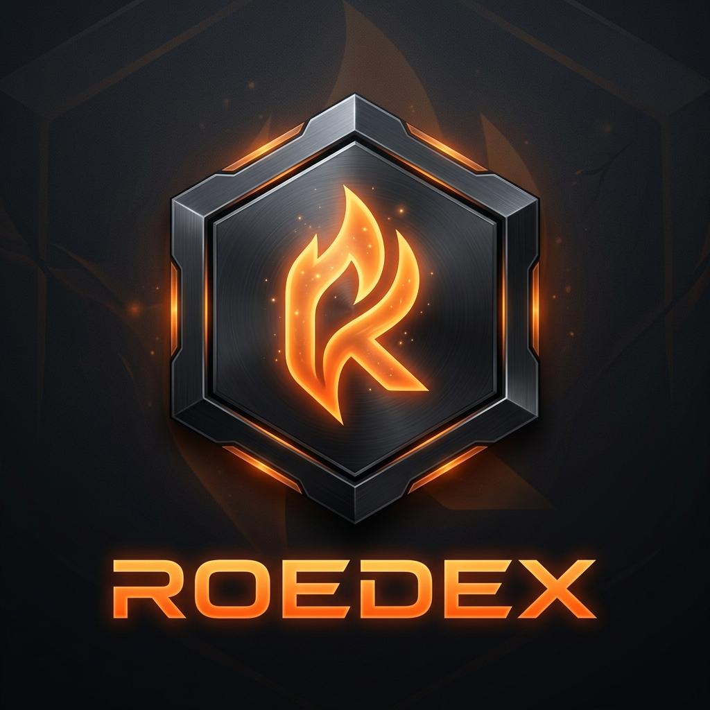

<div align="center">
  
  
  # Herramienta de Acompañamiento ROEDEX
  
  ### *El rastreador definitivo en tiempo real y la suite de superposición interactiva para Roots of Embervault*

  <p align="center">
    <a href="README.md">🇺🇸 English</a> • 
    <a href="README.es.md">🇪🇸 Español</a> • 
    <a href="README.ru.md">🇷🇺 Русский</a> • 
    <a href="README.ko.md">🇰🇷 한국어</a>
  </p>

  ---

  <p align="center">
    <a href="https://chromewebstore.google.com/detail/roedex/fgdehjebfkbdefdnenpgjejjnhlkchjh" target="_blank">
      
    </a>
  </p>

  <p align="center">
    
    
    
    
  </p>
</div>

> [!IMPORTANT]
> **Colaboración y Soporte Oficial:**  
> ROEDEX se desarrolla en estrecha colaboración con **Voxel Queen** (Co-Fundadora de *Roots of Embervault*) y cuenta con el apoyo oficial de **Ruyui Studios** a través de la entrega de datos brutos del mapa del juego. ¡Esta colaboración permite el funcionamiento de nuestro mapeo de aparición estática de alta precisión y herramientas de navegación avanzada!

---

## 📖 Tabla de Contenidos
1. [🌟 Resumen](#-resumen)
2. [✨ Características Clave](#-características-clave)
3. [📢 Novedades en v0.0.4](#-novedades-en-v004)
4. [🎮 Atajos de Teclado](#-atajos-de-teclado)
5. [🔒 Seguridad y Privacidad](#-seguridad-y-privacidad)
6. [🛠️ Guía de Instalación](#️-guía-de-instalación)
7. [🏆 Créditos y Agradecimientos](#-créditos-y-agradecimientos)
8. [🤝 Soporte y Contribuciones](#-soporte-y-contribuciones)

---

## 🌟 Resumen

**ROEDEX** es una extensión de superposición en el lado del cliente premium y no intrusiva para *Roots of Embervault*. Al leer de forma pasiva el tráfico entrante de WebSockets, ROEDEX proporciona a los jugadores acceso instantáneo a estadísticas en tiempo real, rastreadores de aparición, registros de botín y compañeros interactivos.

Construido utilizando **Manifest V3**, **React**, y **Tailwind CSS**, cuenta con una hermosa interfaz de usuario flotante con estilo Glassmorphism que coincide con la sensación de alta calidad de los paneles de juego AAA.

---

## ✨ Características Clave

| Característica | Descripción |
| :--- | :--- |
| **📈 Monitoreo en Vivo** | Cálculos en tiempo real de XP/h, Piedras Rúnicas/h, y valor bruto del oro y botín. |
| **🤖 Compañeros de IA Interactivos** | 4 compañeros únicos (**Bob**, **Kaya**, **Lia** y **Crash**) que reaccionan dinámicamente a los eventos del juego. |
| **🗺️ Apariciones de Alta Precisión** | Rastrea la distancia y las colas de reaparición precisas para recursos, NPCs y jefes utilizando datos oficiales de mapas. |
| **⚔️ Alertas de Durabilidad de Equipo** | Monitoreo en tiempo real de la durabilidad de armas y armaduras con advertencias antes de romperse. |
| **🌐 Núcleo Multilingüe** | Completamente traducido al **inglés, español, ruso y coreano** con guías de ubicación personalizadas. |
| **🎨 Temas Glassmorphism** | Temas Obsidian Gold, Hologram y Ruby Glass con ventanas emergentes arrastrables y desmontables. |
| **📐 Personalización Dinámica** | Cambio de tamaño completo en 8 direcciones, rotación de diseño (vertical/horizontal) y persistencia de posición. |
| **⚡ Optimización Auditada** | Sin fugas de memoria (auditado para sesiones de más de 12 horas), recursos completamente comprimidos y bloques de compilación Vite optimizados. |

---

## 📢 Novedades en v0.0.4

*   🌍 **Localización Completa:** Se migraron todas las pantallas restantes de la interfaz de usuario (Tablón de Misiones, Herrero, Vista de Jugadores) a nuestro motor de traducción.
*   🐛 **Solución de HUD de Cofre Pegajoso:** Se solucionó un problema por el cual cerrar los cofres mientras se movían objetos dejaba el valor del cofre mínimo pegado en la pantalla.
*   ⌨️ **Persistencia de Atajos:** Las asociaciones de teclas personalizadas (bloqueo de UI, cambio de diseño, restablecimiento de tamaño) ahora persisten correctamente tras reiniciar la extensión.
*   ⏱️ **Secuencia de Inicio Retardada:** La superposición ahora espera al primer paquete de juego activo (con una transición de entrada cinematográfica de 5 segundos) para una entrada más limpia.

---

## 🎮 Atajos de Teclado

Los siguientes atajos se pueden personalizar completamente dentro de la pestaña de **Ajustes**:

| Acción | Atajo Predeterminado | Descripción |
| :--- | :--- | :--- |
| **Minimizar / Maximizar HUD** | `Ctrl + Shift + M` | Contrae o expande toda la interfaz de ROEDEX en un orbe flotante minimizado. |
| **Cambiar Modo de Diseño** | `Shift + H` | Intercambia entre los modos de visualización de columna vertical y fila horizontal. |
| **Restablecer Tamaño de Superposición** | `Shift + R` | Restablece las dimensiones de todas las ventanas a sus valores estándar optimizados. |
| **Bloquear / Desbloquear Interfaz** | `Shift + U` | Bloquea la posición de las ventanas y habilita el modo de clic transparente para no interrumpir el juego. |

---

## 🔒 Seguridad y Privacidad

Creemos en la transparencia absoluta. **ROEDEX recopila CERO datos de usuario.**

*   **100% en el Cliente:** Todos los ajustes, historiales de botín y diseños personalizados se almacenan localmente en tu máquina a través de IndexedDB/localStorage.
*   **Sin Inyección:** ROEDEX no inyecta scripts ni modifica el cliente de juego. Cumple con los sistemas anti-trampas.
*   **Escucha Pasiva:** La extensión funciona puramente como un espectador del tráfico WebSocket del juego para mostrar los datos.
*   **Permisos Acotados:** La extensión solo solicita permiso de host para el dominio oficial del juego.

Para más detalles, consulta nuestra [Política de Privacidad](PRIVACY_POLICY.md).

---

## 🛠️ Guía de Instalación

### Opción A: Web Store (Recomendado)
1. Visita la página de **ROEDEX** en Chrome Web Store.
2. Haz clic en **Añadir a Chrome**.
3. Fija la extensión en la barra de herramientas de tu navegador.
4. Inicia el juego; ¡la extensión se inicializará automáticamente!

### Opción B: Modo Desarrollador (Desde el Código Fuente)
1. Clona el repositorio:
   ```bash
   git clone https://github.com/LordCyberr/ROEDEX.git
   ```
2. Navega al directorio e instala las dependencias:
   ```bash
   npm install
   ```
3. Ejecuta el compilador:
   ```bash
   npm run build
   ```
4. Abre Chrome y navega a `chrome://extensions/`.
5. Activa el **Modo de desarrollador** (interruptor superior derecho).
6. Haz clic en **Cargar descomprimida** y selecciona la carpeta `dist` generada.

---

## 🏆 Créditos y Agradecimientos

ROEDEX es posible gracias a la dedicación de nuestra comunidad y el apoyo de los creadores del juego:

*   👑 **Lord Cyberr** – Desarrollador Principal y Creador del Proyecto
*   🛠️ **MrSnorch** – Contribuciones, orientación y soporte de arquitectura.
*   💎 **Voxel Queen** – Co-Fundadora de *Roots of Embervault* — por sus llamadas, orientación y por proveer los archivos brutos de los mapas.
*   🎮 **Ruyui Studios** – Los desarrolladores de *Roots of Embervault*, por apoyar las modificaciones de la comunidad y la co-creación.

---

## 🤝 Soporte y Contribuciones

ROEDEX es gratuito, de código abierto y mantenido en nuestro tiempo libre. Si esta herramienta ha hecho que tus aventuras sean más eficientes, ¡considera darle una estrella al repositorio ⭐!

Si deseas apoyar con los costos del servidor, recursos y actualizaciones futuras, puedes enviar donaciones opcionales a:

<details>
<summary><b>🪙 Haz clic para expandir las direcciones de donación de EVM y Solana</b></summary>

*   **Abstract Chain**: `0xeb6C0506F624239dAa704c375d0494B14ea81322`
*   **Billetera Global (EVM)**: `0x364aC821eEf0D90678F0B6df44b700d3Df14D89a`
*   **Solana**: `GzRU5v4Tyqx7iGrc7Saed943gMnbMuEDwrpC9vZWyreq`

</details>

*Las contribuciones son completamente opcionales. ¡Gracias por apoyar a la comunidad!*

---
<div align="center">
  <p><i>Creado con ❤️ para la comunidad de Roots of Embervault.</i></p>
</div>
