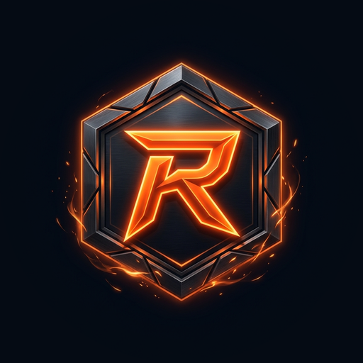

<div align="center">
  <a href="https://chromewebstore.google.com/detail/roedex/fgdehjebfkbdefdnenpgjejjnhlkchjh" target="_blank">
    
  </a>
  
  <h1 align="center" style="font-size: 2.2rem; font-weight: 900; letter-spacing: 2px;">⚡ ROEDEX COMPANION TOOL</h1>
  
  <p align="center"><b>The Ultimate Real-Time HUD Overlay & Tactical Companion Suite for <i>Roots of Embervault</i></b></p>
  <p align="center"><i>60 FPS Frame-Sync Engine • Sub-Millisecond Packet Parser • 100% Client-Side & Anti-Cheat Compliant</i></p>

  <p align="center">
    <a href="README.md"><b>🇺🇸 English</b></a> &nbsp;•&nbsp; 
    <a href="README.es.md"><b>🇪🇸 Español</b></a> &nbsp;•&nbsp; 
    <a href="README.ru.md"><b>🇷🇺 Русский</b></a> &nbsp;•&nbsp; 
    <a href="README.ko.md"><b>🇰🇷 한국어</b></a>
  </p>

  <p align="center">
    <a href="https://chromewebstore.google.com/detail/roedex/fgdehjebfkbdefdnenpgjejjnhlkchjh" target="_blank">
      
    </a>
    
    
    
  </p>

  <p align="center">
    
    
    
    
    
  </p>

  <p align="center">
    <a href="#-key-features"><b>🌟 Features</b></a> &nbsp;•&nbsp; 
    <a href="#-whats-new-in-v005"><b>📢 What's New</b></a> &nbsp;•&nbsp; 
    <a href="#-engine-performance--benchmarks"><b>⚡ Benchmarks</b></a> &nbsp;•&nbsp; 
    <a href="#-keyboard-shortcuts"><b>🎮 Hotkeys</b></a> &nbsp;•&nbsp; 
    <a href="#️-installation-guide"><b>🛠️ Install</b></a> &nbsp;•&nbsp; 
    <a href="#-credits--acknowledgements"><b>🏆 Credits</b></a>
  </p>
</div>

> [!IMPORTANT]
> **Community Project Disclaimer & Attributions:**  
> ROEDEX is an independent community-run tool and is **not** audited or officially endorsed by **Ruyui Studios**.  
> The advanced map features and coordinate trackers are powered by raw map data generously provided by **Voxel Queen** (Co-Founder of *Roots of Embervault*).

---

## 📖 Table of Contents
1. [🌟 Overview](#-overview)
2. [✨ Key Features](#-key-features)
3. [⚡ Engine Performance & Benchmarks](#-engine-performance--benchmarks)
4. [📢 What's New in v0.0.5](#-whats-new-in-v005)
5. [🎮 Keyboard Shortcuts](#-keyboard-shortcuts)
6. [🔒 Security & Privacy](#-security--privacy)
7. [🛠️ Installation Guide](#️-installation-guide)
8. [🏆 Credits & Acknowledgements](#-credits--acknowledgements)
9. [🤝 Support & Contributions](#-support--contributions)

---

## 🌟 Overview

**ROEDEX** is a premium, non-intrusive client-side overlay extension for *Roots of Embervault*. By passively reading incoming WebSocket traffic, ROEDEX provides players with instant access to real-time statistics, spawn trackers, loot logs, and interactive companions. 

Built using **Manifest V3**, **React**, and **Tailwind CSS**, it features a gorgeous floating Glassmorphism UI that matches the high-quality feel of AAA gaming dashboards.

---

## ✨ Key Features

<table>
  <tr>
    <td width="50%" valign="top">
      <h3>🗺️ Tactical Radar & Dynamic Minimap</h3>
      <p>Real-time offscreen canvas rendering with zero DOM jank. Powered by dedicated A* Web Workers, automatic death-drop recovery routers, and live respawn countdowns across all game zones.</p>
      <p>
        
        
        
      </p>
    </td>
    <td width="50%" valign="top">
      <h3>🏪 Live Economy & Bazaar Intelligence</h3>
      <p>Instant market order books, price sparklines, bazaar grid view, and real-time profit-per-hour telemetry (XP/hr, Runestones/hr, Gold/hr) computed live on the HUD.</p>
      <p>
        
        
        
      </p>
    </td>
  </tr>
  <tr>
    <td width="50%" valign="top">
      <h3>⚔️ Combat HUD & Durability Telemetry</h3>
      <p>Real-time weapon and armor durability monitors, target lock-on health bars, and low-HP screen pulse alerts. Never lose rare gear to surprise durability breaks.</p>
      <p>
        
        
        
      </p>
    </td>
    <td width="50%" valign="top">
      <h3>🤖 Interactive AI Companions</h3>
      <p>Four distinct companion personas (<b>Bob</b>, <b>Kaya</b>, <b>Lia</b>, and <b>Crash</b>) equipped with reactive CRT facial animations and contextual commentary during combat and rare loot drops.</p>
      <p>
        
        
        
      </p>
    </td>
  </tr>
  <tr>
    <td width="50%" valign="top">
      <h3>🔍 Global Instant Database Search</h3>
      <p>Hotkey-driven modal (<code>Ctrl + Shift + F</code>) allowing instant fuzzy search across every NPC, drop table, resource node, and quest in Embervault without leaving your run.</p>
      <p>
        
        
        
      </p>
    </td>
    <td width="50%" valign="top">
      <h3>🎨 Obsidian Glassmorphism Architecture</h3>
      <p>Fully customizable floating UI with 8-way directional resizing, layout flipping (vertical column / horizontal row), and detachable pop-out windows that remember exact screen coordinates.</p>
      <p>
        
        
        
      </p>
    </td>
  </tr>
</table>

---

## ⚡ Engine Performance & Benchmarks

ROEDEX is engineered with AAA gaming performance standards. It operates purely as an out-of-process spectator with zero overhead on the game canvas:

| Metric / Subsystem | Benchmark | Engineering Implementation |
| :--- | :---: | :--- |
| **FPS Stability** | **Solid 60 FPS** | `RafScheduler.ts` synchronizes all state updates into a single frame loop |
| **Memory Consumption** | **< 45 MB** | Offscreen canvas trail baking + automated 30-day analytics pruning |
| **Packet Latency** | **< 1 ms** | Runs directly in `world: MAIN` WebSocket spectator context |
| **A* Pathfinding Speed** | **< 3 ms / query** | MinHeap-driven A* pathfinder isolated in dedicated Web Worker |
| **Bundle Architecture** | **< 500 kB Chunks** | Pure manual vendor splitting (`vendor_charts`, `vendor_motion`, `vendor_db`) |
| **Data Privacy** | **100% Local** | Zero external telemetry; encrypted IndexedDB storage with 5s batching |

---

## 📢 What's New in v0.0.5

*   🔔 **What's New Notification Banner:** An animated, glassmorphic banner alerts players to updates, highlighting feature counts and linking directly to the in-overlay changelog.
*   🏪 **Marketplace & Economy Hub:** Live item listings, price sparklines, bazaar grid view, and market analytics tab.
*   📊 **Profile & Daily Dashboard:** View daily gameplay breakdowns, session combat logs, and lifetime statistics.
*   🔍 **Global Search Modal:** Instant hotkey lookup across all NPCs, resources, quests, and drop tables.
*   ⚡ **60 FPS RafScheduler Engine:** 50%+ bundle reduction, offscreen minimap rendering, and unified frame scheduler.
*   🗺️ **Dynamic Waypoint Router:** Multi-zone pathfinding with Web Workers and automatic death drop routing.
*   ❤️ **Target & Player HP Bars:** Dedicated, highly customizable health overlay bars with low-health alerts.
*   🛡️ **Hardened Storage:** Shared IndexedDB storage with debounced batching and emergency save.

---

## 🎮 Keyboard Shortcuts

All hotkeys are rebindable on-the-fly inside the **Settings → Controls** panel:

| Action | Default Shortcut | Description |
| :--- | :---: | :--- |
| **Global Instant Search** | <kbd>Ctrl</kbd> + <kbd>Shift</kbd> + <kbd>F</kbd> | Instant fuzzy search across all NPCs, drop tables, and resources. |
| **Minimize / Maximize HUD** | <kbd>Ctrl</kbd> + <kbd>Shift</kbd> + <kbd>M</kbd> | Collapse the entire ROEDEX suite into an animated floating orb. |
| **Toggle Layout Mode** | <kbd>Shift</kbd> + <kbd>H</kbd> | Swap between Vertical Sidebar and Horizontal Banner layouts. |
| **Reset Overlay Geometry** | <kbd>Shift</kbd> + <kbd>R</kbd> | Recalibrate all active window positions to clean defaults. |
| **Lock / Click-Through Mode** | <kbd>Shift</kbd> + <kbd>U</kbd> | Lock window coordinates and pass clicks directly to the game canvas. |

---

## 🔒 Security & Privacy

We believe in absolute transparency. **ROEDEX collects ZERO user data.**

*   **100% Client-Side:** All settings, loot histories, and custom layouts are stored locally on your machine via IndexedDB/localStorage.
*   **No Injection:** ROEDEX does not inject scripts or modify the game client. It is anti-cheat compliant.
*   **Passive Listening:** The extension acts purely as a spectator on the game's WebSocket traffic to display data.
*   **Scoped Permissions:** The extension only requests host permission for the official game domain.

For details, view our [Privacy Policy](PRIVACY_POLICY.md).

---

## 🛠️ Installation Guide

### Option A: Web Store (Recommended)
1. Visit the **ROEDEX** Chrome Web Store page.
2. Click **Add to Chrome**.
3. Pin the extension to your browser toolbar.
4. Launch the game; the extension will initialize automatically!

### Option B: Developer Mode (From Source)
1. Clone the repository:
   ```bash
   git clone https://github.com/LordCyberr/ROEDEX.git
   ```
2. Navigate to the directory and install dependencies:
   ```bash
   npm install
   ```
3. Run the compiler:
   ```bash
   npm run build
   ```
4. Open Chrome and navigate to `chrome://extensions/`.
5. Enable **Developer Mode** (top-right toggle).
6. Click **Load Unpacked** and select the generated `dist` folder.

---

## 🏆 Credits & Acknowledgements

ROEDEX is made possible by the dedication of our community and the support of the game creators:

*   👑 **Lord Cyberr** – Lead Developer & Project Creator
*   🛠️ **MrSnorch** – Contributions, guidance, and architecture support.
*   💎 **Voxel Queen** – Co-Founder of *Roots of Embervault* — for her calls, guidance, and providing the raw map files.
*   🎮 **Ruyui Studios** – The developers of *Roots of Embervault* (Note: ROEDEX is an independent project and is not officially affiliated with Ruyui Studios).

---

## 🤝 Support & Contributions

ROEDEX is free, open-source, and maintained in our spare time. If this tool has made your adventures more efficient, please consider starring the repository ⭐!

If you wish to support server costs, assets, and future updates, optional donations can be sent to:

<details>
<summary><b>🪙 Click to expand EVM & Solana Donation Addresses</b></summary>

*   **Abstract Chain**: `0xeb6C0506F624239dAa704c375d0494B14ea81322`
*   **Global Wallet (EVM)**: `0x364aC821eEf0D90678F0B6df44b700d3Df14D89a`
*   **Solana**: `GzRU5v4Tyqx7iGrc7Saed943gMnbMuEDwrpC9vZWyreq`

</details>

*Contributions are entirely optional. Thank you for supporting the community!*

---
<div align="center">
  <p><i>Crafted with ❤️ for the Roots of Embervault community.</i></p>
</div>
